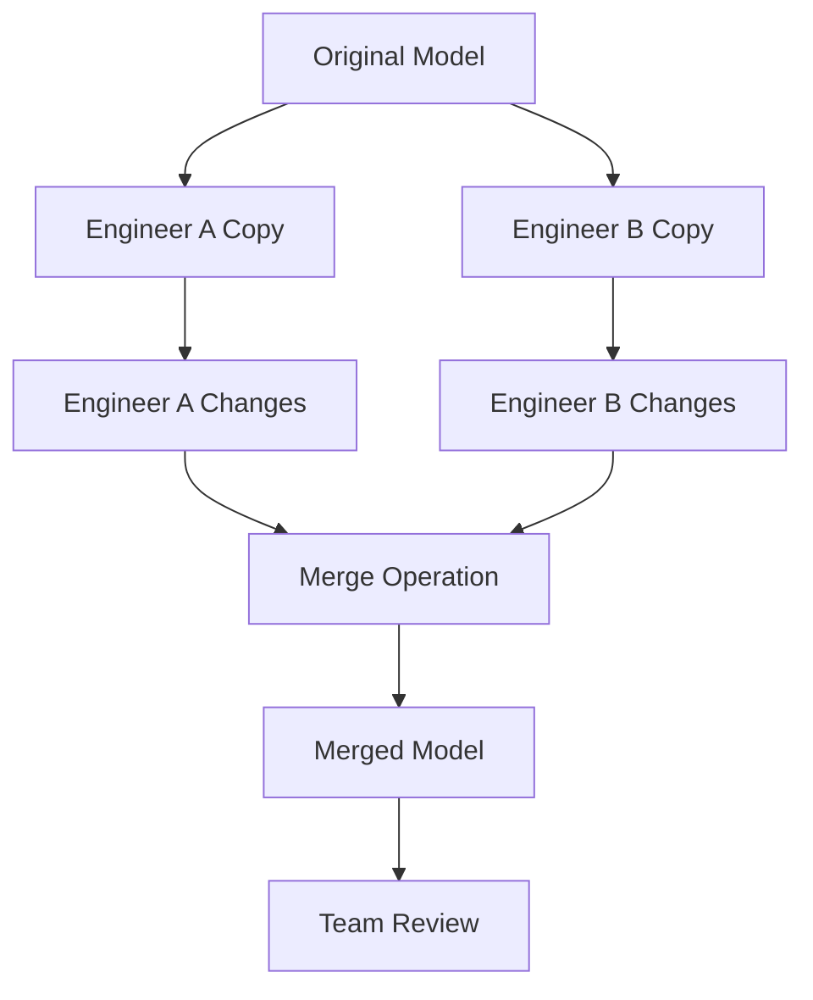

# ETABS Sync CLI User Guide

*Version 2.0 - Complete Guide for Structural Engineers*

## Table of Contents

1. [Introduction](#introduction)
2. [System Requirements](#system-requirements)
3. [Installation](#installation)
4. [Quick Start Guide](#quick-start-guide)
5. [Basic Operations](#basic-operations)
6. [Advanced Features](#advanced-features)
7. [Troubleshooting](#troubleshooting)
8. [Best Practices](#best-practices)
9. [FAQ](#faq)
10. [Support](#support)

---

## Introduction

ETABS Sync CLI is a professional-grade tool for synchronizing changes between different versions of ETABS structural models. It provides a Git-like three-way merge system specifically designed for structural engineering workflows.

### What Problems Does It Solve?

- **Collaboration Conflicts**: Multiple engineers working on the same model
- **Version Control**: Merging changes from different model versions
- **Data Loss Prevention**: Safe integration without losing engineering work
- **Workflow Automation**: Automated conflict detection and resolution

### Key Features

- ✅ **Three-Way Merge**: Intelligent merging of structural model changes
- ✅ **Conflict Detection**: Automatic identification of conflicting modifications
- ✅ **Safety-First Design**: Backup and rollback capabilities
- ✅ **Engineering Intelligence**: Structural-aware conflict resolution
- ✅ **Comprehensive Reporting**: Detailed documentation of all changes

---

## System Requirements

### Minimum Requirements

- **Operating System**: Windows 10 or newer (64-bit)
- **Python**: Version 3.8 or newer
- **Memory**: 4 GB RAM minimum, 8 GB recommended
- **Disk Space**: 2 GB available space
- **ETABS**: Version 18 or newer with valid license

### Recommended System

- **CPU**: Intel i5 or AMD Ryzen 5 (or better)
- **Memory**: 16 GB RAM for large models
- **Disk**: SSD with 10+ GB available space
- **ETABS**: Latest version (21+) for best compatibility

### Dependencies

The following Python packages are automatically installed:
- `comtypes` - ETABS COM API interface
- `psutil` - System monitoring
- `dataclasses` - Data structure support (Python 3.8+)

---

## Installation

### Step 1: Install Python

1. Download Python 3.8+ from [python.org](https://www.python.org/downloads/)
2. **Important**: Check "Add Python to PATH" during installation
3. Verify installation: Open Command Prompt and run:
   ```cmd
   python --version
   ```

### Step 2: Install ETABS Sync CLI

```cmd
# Clone or download the ETABS Sync CLI
cd "C:\etabs_sync_cli_v2"

# Install dependencies
pip install -r requirements.txt
```

### Step 3: Verify Installation

Run the diagnostic tool to check your system:

```cmd
python examples/comprehensive_testing_demo.py --integration
```

If all tests pass, you're ready to use ETABS Sync CLI!

---

## Quick Start Guide

### Your First Merge Operation

This 5-minute tutorial demonstrates merging two versions of a simple beam model.

#### Prerequisites
- ETABS installed and licensed
- Three model files: `original.edb`, `version_a.edb`, `version_b.edb`

#### Step 1: Run Sync Operation

```cmd
python -m etabs_sync_cli sync --root original.edb --version-a version_a.edb --version-b version_b.edb --output merged.edb
```

#### Step 2: Review Results

The tool will:
1. Extract data from all three models
2. Compare changes between versions
3. Detect and resolve conflicts
4. Apply changes to create `merged.edb`
5. Generate detailed reports

#### Step 3: Examine Output

Check the generated files:
- `merged.edb` - Your merged model
- `merge_report_YYYYMMDD_HHMMSS.txt` - Detailed merge report
- `merge_summary_YYYYMMDD_HHMMSS.txt` - Executive summary

🎉 **Congratulations!** You've successfully completed your first merge operation.

---

## Basic Operations

### Command Structure

All ETABS Sync CLI operations follow this pattern:

```cmd
python -m etabs_sync_cli <command> [options] <arguments>
```

### Core Commands

#### 1. Sync Command (Three-Way Merge)

Merge changes from two versions into the original model:

```cmd
python -m etabs_sync_cli sync --root <original.edb> --version-a <version_a.edb> --version-b <version_b.edb> [options]
```

**Options:**
- `--output <file>` - Output filename (default: adds "_merged" suffix)
- `--interactive` - Enable interactive conflict resolution
- `--auto-resolve` - Automatically resolve conflicts using engineering rules
- `--backup` - Create backup of original file (recommended)
- `--validate` - Run validation checks before and after merge

**Example:**
```cmd
python -m etabs_sync_cli sync --root building_original.edb --version-a building_structural.edb --version-b building_architectural.edb --output building_final.edb --interactive --backup
```

#### 2. Compare Command

Compare two models to see differences:

```cmd
python -m etabs_sync_cli compare <model1.edb> <model2.edb> [options]
```

**Options:**
- `--output <file>` - Save comparison report to file
- `--format <type>` - Report format: text, html, json
- `--details` - Include detailed element-by-element comparison

**Example:**
```cmd
python -m etabs_sync_cli compare current_model.edb updated_model.edb --output comparison_report.txt --details
```

#### 3. Validate Command

Check model integrity and structure:

```cmd
python -m etabs_sync_cli validate <model.edb> [options]
```

**Options:**
- `--strict` - Use strict validation rules
- `--output <file>` - Save validation report
- `--fix-minor` - Automatically fix minor issues

**Example:**
```cmd
python -m etabs_sync_cli validate problematic_model.edb --strict --output validation_results.txt
```

#### 4. Diagnostics Command

Check system health and ETABS installation:

```cmd
python -m etabs_sync_cli diagnostics [options]
```

**Options:**
- `--level <basic|standard|advanced|full>` - Diagnostic level
- `--output <file>` - Save diagnostic report
- `--fix-issues` - Attempt to fix detected issues

**Example:**
```cmd
python -m etabs_sync_cli diagnostics --level full --output system_health.txt
```

### Understanding Output Files

#### Merge Reports

After each sync operation, you'll get several reports:

1. **Executive Summary** (`*_summary.txt`)
   - High-level overview of changes
   - Success/failure status
   - Key statistics and recommendations

2. **Technical Report** (`*_technical.txt`)
   - Detailed technical analysis
   - Element-by-element changes
   - API operation logs

3. **Conflict Report** (`*_conflicts.txt`)
   - All conflicts detected
   - Resolution strategies used
   - Manual resolution recommendations

4. **Audit Trail** (`*_audit.txt`)
   - Complete decision history
   - Backup information
   - Recovery instructions

---

## Advanced Features

### Interactive Conflict Resolution

When conflicts are detected, you can choose manual resolution:

```cmd
python -m etabs_sync_cli sync --root model.edb --version-a v1.edb --version-b v2.edb --interactive
```

**Interactive Conflict Resolution Process:**

1. **Conflict Presentation**: View detailed information about each conflict
2. **Option Selection**: Choose between Version A, Version B, or custom solution
3. **Impact Assessment**: See how your choice affects the model
4. **Confirmation**: Confirm your decisions before applying

**Example Conflict Dialog:**
```
CONFLICT DETECTED: Joint J5
━━━━━━━━━━━━━━━━━━━━━━━━━━━━━━━━━━━━━━━━━━━━━━━━━━━━

Description: Joint J5 moved to different locations

Version A: Joint J5 at coordinates (10.0, 5.0, 3.0)
Version B: Joint J5 at coordinates (10.0, 5.2, 3.0)

Engineering Impact: MINOR - Small coordinate change (0.2m difference)

Options:
[A] Accept Version A coordinates
[B] Accept Version B coordinates  
[C] Enter custom coordinates
[S] Skip this conflict (manual resolution later)

Your choice [A/B/C/S]: 
```

### Batch Operations

Process multiple models efficiently:

```cmd
# Process all models in a directory
python -m etabs_sync_cli batch-sync --directory "C:\Models" --pattern "*.edb" --output-dir "C:\Merged"

# Validate multiple models
python -m etabs_sync_cli batch-validate --models model1.edb model2.edb model3.edb
```

### Custom Configuration

Create a configuration file for your workflow:

**etabs_sync_config.json:**
```json
{
  "default_backup": true,
  "auto_resolve_minor": true,
  "validation_level": "standard",
  "output_format": "detailed",
  "element_tolerance": 0.001,
  "conflict_strategy": "conservative",
  "report_templates": {
    "executive": true,
    "technical": true,
    "audit": false
  }
}
```

Use with:
```cmd
python -m etabs_sync_cli sync --config etabs_sync_config.json --root model.edb --version-a v1.edb --version-b v2.edb
```

### API Integration

Integrate ETABS Sync CLI into your existing tools:

```python
from etabs_sync_cli import ETABSSyncAPI

# Initialize API
api = ETABSSyncAPI()

# Perform sync operation
result = api.sync_models(
    root_model="original.edb",
    version_a="version_a.edb", 
    version_b="version_b.edb",
    output_path="merged.edb"
)

# Check results
if result.success:
    print(f"Merge successful: {result.statistics.success_rate:.1%}")
    print(f"Changes applied: {result.statistics.total_instructions}")
else:
    print(f"Merge failed: {result.error_message}")
```

---

## Troubleshooting

### Common Issues and Solutions

#### Issue: "ETABS COM interface not accessible"

**Symptoms:**
- Error message about COM registration
- Cannot connect to ETABS

**Solutions:**
1. **Reinstall ETABS**: Complete reinstallation fixes COM registration
2. **Register COM manually**: Run as administrator:
   ```cmd
   regsvr32 "C:\Program Files\Computers and Structures\ETABS XX\ETABSv1.dll"
   ```
3. **Check ETABS version**: Ensure version 18 or newer

#### Issue: "Model file cannot be opened"

**Symptoms:**
- File access errors
- Corrupted model messages

**Solutions:**
1. **Check file permissions**: Ensure read/write access to model files
2. **Verify file integrity**: Open file in ETABS GUI first
3. **Check disk space**: Ensure adequate free space (5GB+ recommended)
4. **Use backup**: Restore from backup if available

#### Issue: "Memory error during processing"

**Symptoms:**
- Out of memory errors
- System becomes unresponsive

**Solutions:**
1. **Increase virtual memory**: Set Windows page file to 16GB+
2. **Close other applications**: Free up system memory
3. **Process in batches**: Use smaller model sections
4. **Upgrade RAM**: 16GB+ recommended for large models

#### Issue: "Conflicts cannot be resolved automatically"

**Symptoms:**
- Many unresolved conflicts
- Automatic resolution fails

**Solutions:**
1. **Use interactive mode**: Manually resolve conflicts
   ```cmd
   python -m etabs_sync_cli sync --interactive
   ```
2. **Review model changes**: Understand what each version changed
3. **Consult with team**: Coordinate with other engineers
4. **Use staged approach**: Merge simpler changes first

### Diagnostic Tools

Run comprehensive diagnostics:

```cmd
python -m etabs_sync_cli diagnostics --level full
```

This checks:
- ✅ Python environment and dependencies
- ✅ ETABS installation and registration
- ✅ System resources (memory, disk, CPU)
- ✅ File permissions and access
- ✅ COM component registration
- ✅ Performance benchmarks

### Getting Help

#### Log Files

All operations create detailed log files:
- `etabs_sync_YYYYMMDD.log` - Main operation log
- `merge_demo_YYYYMMDD_HHMMSS.log` - Merge operation details
- `diagnostics_YYYYMMDD_HHMMSS.log` - System diagnostic results

#### Verbose Mode

Get more detailed information:

```cmd
python -m etabs_sync_cli sync --verbose --root model.edb --version-a v1.edb --version-b v2.edb
```

#### Debug Mode

For development and troubleshooting:

```cmd
python -m etabs_sync_cli sync --debug --root model.edb --version-a v1.edb --version-b v2.edb
```

---

## Best Practices

### Model Management

#### 1. Use Consistent Naming
- **Elements**: Use descriptive names (B1, B2, C1, C2, not Frame1, Frame2)
- **Files**: Include version info (Building_v1.0.edb, Building_v2.0.edb)
- **Directories**: Organize by project and version

#### 2. Regular Backups
```cmd
# Always create backups before merging
python -m etabs_sync_cli sync --backup --root model.edb --version-a v1.edb --version-b v2.edb
```

#### 3. Incremental Changes
- Make smaller, focused changes rather than large modifications
- Test merge operations with small changes first
- Document significant model modifications

### Collaboration Workflow

#### 1. Team Coordination


#### 2. Change Documentation
- Document what changes you're making
- Use meaningful commit-like messages
- Include reasoning for major modifications

#### 3. Testing Protocol
1. **Test with small models first**
2. **Validate merged models in ETABS**
3. **Run structural analysis on merged results**
4. **Compare analysis results with originals**

### Performance Optimization

#### 1. System Optimization
- **Close unnecessary applications** during merge operations
- **Use SSD storage** for better performance
- **Ensure adequate RAM** (16GB+ for large models)

#### 2. Model Optimization
- **Remove unused elements** before merging
- **Simplify complex geometry** if possible
- **Use consistent coordinate systems**

#### 3. Batch Processing
```cmd
# Process multiple models overnight
python scripts/batch_merge.py --input-dir "Projects\Building_A" --schedule "02:00"
```

---

## FAQ

### General Questions

**Q: Can ETABS Sync CLI work with older versions of ETABS?**
A: ETABS version 18 or newer is required. Earlier versions may work but are not officially supported.

**Q: Does the tool work with ETABS educational versions?**
A: Yes, as long as the educational license allows COM API access.

**Q: Can I use this with SAP2000 models?**
A: Not currently. This tool is specifically designed for ETABS models.

### Technical Questions

**Q: How large can the models be?**
A: Successfully tested with models up to 10,000 elements. Performance scales with available system memory.

**Q: What happens if ETABS crashes during a merge?**
A: The tool includes automatic backup and recovery. Your original files remain safe.

**Q: Can I automate this as part of a larger workflow?**
A: Yes, the tool supports scripting and API integration for workflow automation.

### Workflow Questions

**Q: How do I handle models with different unit systems?**
A: Convert all models to consistent units before merging. The tool will warn about unit mismatches.

**Q: What if both engineers modified the same element?**
A: This creates a conflict. Use interactive mode to manually resolve, or rely on automatic resolution with engineering rules.

**Q: Can I undo a merge operation?**
A: Yes, if you used the `--backup` option. The tool creates backups with recovery instructions.

---

## Support

### Documentation Resources

- **Technical Reference**: See `TECHNICAL_DOCUMENTATION.md`
- **API Documentation**: See `docs/api/`
- **Example Scripts**: See `examples/`
- **Development Guide**: See `DEVELOPMENT_GUIDELINES.md`

### Community and Help

- **Issues and Bugs**: Report at project repository
- **Feature Requests**: Submit through project channels
- **User Discussions**: Community forums and mailing lists

### Professional Support

For professional structural engineering projects requiring guaranteed support:
- **Priority Support**: Available for licensed users
- **Custom Integration**: Tailored solutions for specific workflows
- **Training Services**: On-site and remote training available

### Version Information

- **Current Version**: 2.0
- **Release Date**: August 2025
- **Compatibility**: ETABS 18, 19, 20, 21
- **Python Requirement**: 3.8+

---

## Appendices

### Appendix A: Command Reference

Complete command line reference with all options and parameters.

### Appendix B: Configuration Options

Detailed configuration file options and their effects.

### Appendix C: Error Codes

Complete list of error codes and their meanings.

### Appendix D: File Formats

Supported input and output file formats and specifications.

---

*This user guide is part of ETABS Sync CLI v2.0. For the most current information, please refer to the project documentation.*